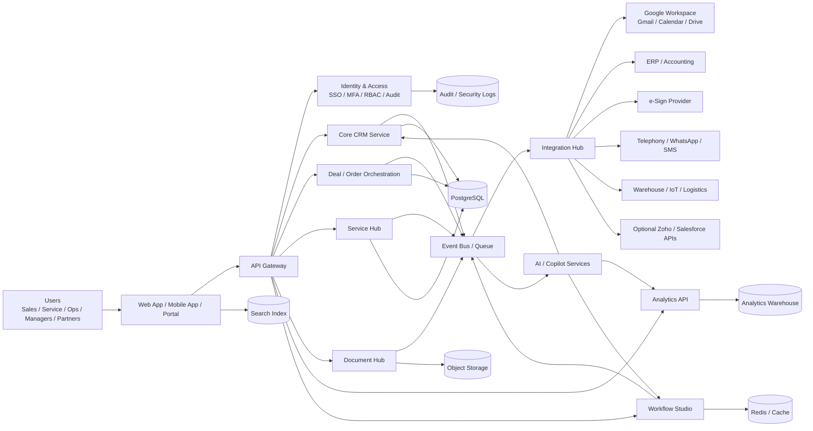
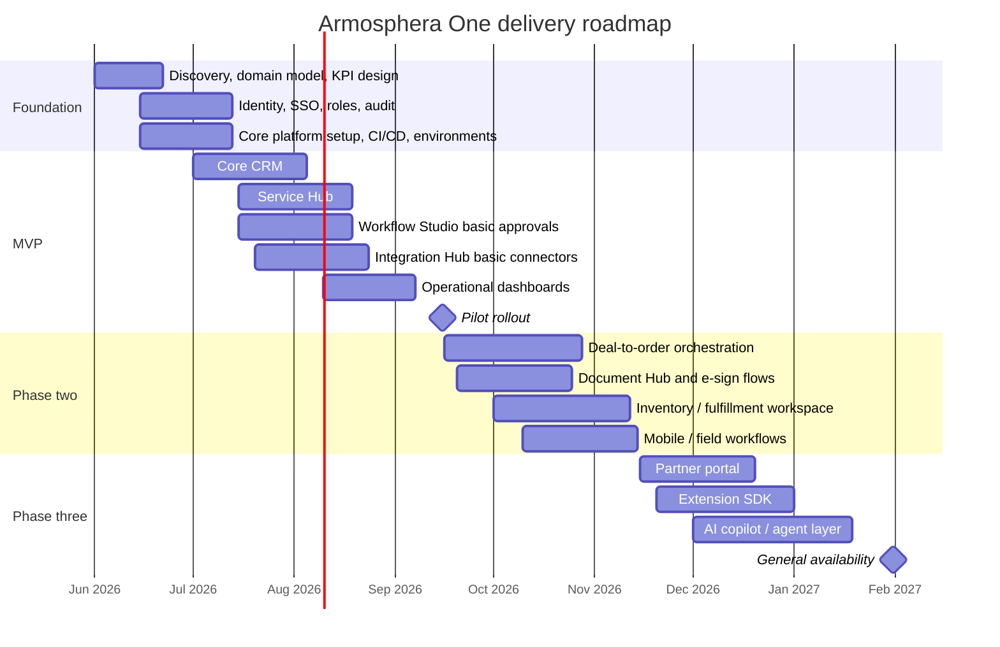

# Deep Research Report on Zoho One and Salesforce Customer 360 with Salesforce Platform

## Executive summary

If the goal is **maximum breadth, fastest suite-level standardization, and the lowest likely software complexity per employee**, **Zoho One** is the stronger package: it bundles more than 50 business applications across sales, marketing, service, finance, HR, operations, collaboration, legal, security, low-code, analytics, and integration under centralized administration and a single invoice. Zoho positions it as an “operating system for business,” and its official pages emphasize unified administration, mobile device management, customization, platform tooling, and broad third-party interoperability. citeturn3view0turn10view4turn16view0turn16view1turn32view2turn38view0

If the goal is **best-in-class enterprise CRM depth, data-platform extensibility, AI/agent ecosystem, partner reach, and enterprise-grade global deployment/compliance controls**, **Salesforce Customer 360 plus the Agentforce 360 Platform** is the stronger choice. Salesforce’s public portfolio centers on sales, service, marketing, commerce, data, platform, Slack, industry clouds, and ecosystem-led extension; Hyperforce adds region choice, public-cloud deployment on major providers, data residency controls, zero-trust security, multi-availability-zone resiliency, and disaster recovery; and Salesforce’s ecosystem pages advertise more than 5,000 prebuilt apps, 200,000 certified experts, 250+ prebuilt agent actions/topics/templates, and 200+ Data 360 connectors. citeturn33view0turn33view2turn31view1turn31view4turn27view0turn27view2turn27view3

My opinionated recommendation is to **avoid cloning either suite end-to-end**. For an **Armosphera One** Vibe/Codex project, the highest-value path is to build a **focused operating layer** that covers the most cross-functional workflows those platforms prove matter most—**customer/account master data, pipeline and order orchestration, service/ticketing, workflow/integration automation, analytics, role-based administration, documents/contracts, and selective field/mobile workflows**—while **integrating** commodity capabilities such as email, calendaring, office docs, payroll, and generic chat rather than rebuilding them. This approach borrows **Zoho’s suite ergonomics** and **Salesforce’s platform discipline** while reducing vendor lock-in and keeping implementation scope realistic. That recommendation is also consistent with recent research showing that agentic automation in complex enterprise software remains hard and benefits from API-first, structured workflows rather than brittle UI-only automation. citeturn38view1turn31view4turn34academia0turn35academia2

Assumption used throughout: **you did not specify hard budget or timeline constraints**, so the recommendation optimizes for **time-to-value, controllable complexity, and strategic flexibility**, not merely the lowest sticker price.

## Connector scan and assumptions

I began with the enabled connectors exactly as requested: **google_drive, google_calendar, gmail**.

| Enabled connector | What I checked first | Result |
|---|---|---|
| `google_drive` | Queries around `zoho`, `salesforce`, `crm` | No clearly relevant internal decision materials surfaced. “zoho” and “salesforce” returned no hits; a broad “crm” search surfaced only opaque folders with no evident relevance. |
| `google_calendar` | Event search for `zoho` and `salesforce` across 2021–2026 | No matching events returned. |
| `gmail` | Message search around `zoho` / `salesforce` | Results were not decision-grade and were dominated by unrelated newsletters / promotional mail. |

The only concrete Drive artifacts that surfaced were two opaque folders from February 2017, which I did **not** treat as relevant evidence for platform selection. fileciteturn4file0L1-L3 fileciteturn4file1L1-L3

Because the connector pass did not reveal reliable internal evaluation material, the rest of this report relies primarily on **official vendor sources**, supplemented selectively by **current research** where it materially improves the analysis.

## Product overviews and core capabilities

The cleanest comparison is not “Zoho One vs one single Salesforce SKU,” because **Salesforce does not publish a single all-departments suite equivalent to Zoho One** in the same way. The closest public comparison is **Zoho One** versus **Salesforce Customer 360’s application portfolio plus the Agentforce 360 Platform**. Salesforce’s Customer 360 pages now redirect into a broader products portfolio, while the former Salesforce Platform is publicly branded as the **Agentforce 360 Platform**. citeturn3view2turn5view3turn6view0turn33view0

### Product comparison at a glance

| Dimension | Zoho One | Salesforce Customer 360 plus Agentforce 360 Platform |
|---|---|---|
| Product concept | Unified business suite / “operating system for business” | Portfolio of CRM applications plus platform, data, AI, and ecosystem layers |
| Core front-office scope | Sales, marketing, support, websites, live chat, loyalty, events | Sales, service, marketing, commerce, AI agents, Slack, industry clouds |
| Back-office / ops scope | Finance, HR, operations, legal, security, collaboration, productivity | Limited as first-class core suite categories in the retrieved public portfolio; many adjacent functions are typically extended via partners or third-party products |
| Platform / builder layer | Creator, Flow, RPA, Sigma, Catalyst, Analytics, DataPrep | Platform, DevOps Center, Flow Automation, MuleSoft, Data 360, Agentforce, websites/custom apps |
| Ecosystem model | Zoho Marketplace plus partner/developer community | AppExchange / AgentExchange, MuleSoft exchanges, certified experts, implementation partners |
| Deployment posture | Cloud suite with web, mobile, and installed app variants | Cloud-first SaaS on Hyperforce across major public clouds with regional data controls |

**Table sources:** Zoho One overview, applications, and platform pages; Salesforce products, platform, infrastructure, and ecosystem pages. citeturn3view0turn10view4turn16view0turn16view1turn3view2turn6view0turn33view2turn27view0turn31view4

### Zoho One

Zoho One’s official positioning is unusually explicit: it is an **all-department operating system**, aimed at helping businesses “win more customers, manage their employees, track their finances, and holistically handle their operations on one unified system.” Zoho publicly states **75,000+ businesses worldwide**, **45+ apps included** on the overview page, **1000+ interoperable integrations**, and in other plan/app pages it describes the Standard edition as **50+ unified business apps**. citeturn33view3turn33view4turn10view4

The suite is broad. Zoho’s applications page groups modules across **Sales, Marketing, Support, Communication, Collaboration, Productivity, Finance, Operations, Human Resources, Business Process, Legal, and Security**. Representative apps include CRM, Bigin, Bookings, CommandCenter, Marketing Automation, Campaigns, Desk, Assist, Mail, Cliq, Projects, WorkDrive, Books, Billing, Inventory, People, Recruit, Creator, Analytics, Flow, DataPrep, RPA, Contracts, Sign, Vault, and OneAuth. That breadth is one of Zoho One’s biggest strategic differentiators. citeturn16view0

Zoho also provides a meaningful builder layer. The Zoho One Platform page highlights **Creator** for low-code custom applications with Deluge, **Flow** for no-code integrations using triggers, webhooks, and Deluge scripts, **RPA** for process automation across systems with or without APIs, **Sigma** for extensions using OAuth 2.0 plus HTML/CSS/JavaScript, and **Catalyst** for serverless services. In practice, this means Zoho One is not just a bundle of apps; it is also a light platform for extending and wiring them together. citeturn16view1turn38view1

### Salesforce Customer 360 plus Agentforce 360 Platform

Salesforce’s public portfolio page describes the application layer as **Sales, Service, Marketing, Commerce, Industries**, plus the **Agentforce** AI layer, **Data 360**, **Slack**, and the **Agentforce 360 Platform** below them. The platform page describes this base as what you use to **build and customize Agentforce and Customer 360**, with capabilities spanning AI, analytics, data security/privacy, MuleSoft, flow automation, DevOps, custom apps, portals, and infrastructure. citeturn3view2turn6view0turn33view2

Salesforce’s scope is therefore strongest where customer-facing operations, enterprise extensibility, partner ecosystems, and data foundations matter most. The public product pages emphasize **category-leading apps for sales, service, marketing, commerce, IT, and more**, a trusted platform for apps and automation, and industry-specific clouds. The platform pages also show how Salesforce increasingly frames the stack as a unified **CRM + Data + AI + Trust** architecture rather than a simple CRM. citeturn33view0turn33view2turn25view2

Where Salesforce diverges from Zoho One is in **suite structure**. In the retrieved public pages, Salesforce’s core portfolio does **not** present finance, payroll, or HR as parallel native top-level suite categories in the way Zoho One does; instead, Salesforce’s public center of gravity is customer operations, platform, ecosystem extension, and industry clouds. That is an important practical difference for anyone hoping to use a single SKU as a company-wide operating suite. This is an inference from the vendor’s public portfolio structure, not a claim that those functions are impossible; in practice they may be covered through partners, industries, or adjacent tools. citeturn16view0turn3view2turn23view1

## Target customers, pricing, deployment, integrations, and market position

### Commercial and operating comparison

| Area | Zoho One | Salesforce Customer 360 plus Platform |
|---|---|---|
| Target customer signal | Positioned for **growing businesses**, but Standard is presented as suitable for companies “of any size” and covers all major departments. citeturn33view3turn10view4 | Positioned for **any size business, in any industry**, but pricing and architecture strongly signal a natural fit from SMB upward into complex enterprise environments. citeturn33view0turn33view2 |
| Pricing model | Official pages show **Essentials** and **Standard** editions, plus **Standard All Employee Pricing** and **Flexible user pricing**, centralized administration, and “one simple invoice.” In the retrieved official static page, the numeric price fields were not exposed, so the **model is verified but the exact current numbers were not reliably visible in the retrieved page text**. citeturn10view4turn10view1turn38view0 | Salesforce does **not** expose one single Customer 360 suite price. Public pricing is modular: **Sales** starts at **$25/user/month** for Starter Suite, **$100** Pro, **$175** Enterprise, **$350** Unlimited, **$550** Agentforce 1 Sales; **Service** starts at **$25**, **$100**, **$175**, **$350**, **$550** respectively, with additional line items such as Web Services API / Data Cloud availability varying by edition. citeturn5view0turn9view0turn9view1turn9view2turn9view3 |
| Deployment | Cloud suite with **web, mobile, and installed versions** of apps; centralized admin and MDM are part of the offer. citeturn10view4turn38view0 | Cloud-first SaaS. **Hyperforce** runs on major public cloud providers including **AWS, Azure, and GCP**, offers region choice, data residency controls, zero-trust defaults, multi-AZ design, DR, and backward compatibility for existing apps/customizations. citeturn27view0turn27view2turn27view3 |
| Integration posture | Officially states **1000+ interoperable integrations**; builder stack includes **Flow**, **webhooks**, **OAuth 2.0**, extensions, serverless, and marketplace distribution. citeturn32view2turn38view1 | Strongest-in-class public ecosystem posture: **MuleSoft**, **Zero Copy Partner Network**, **200+ Data 360 connectors**, **web/API access**, portals/custom apps, and large partner marketplaces. citeturn31view1turn31view4turn33view2turn9view3 |
| Ecosystem / market position | Strong value-suite play with broad departmental coverage and integrated UX; official social proof includes **75,000+ businesses** and **19,000+ reviews** referenced on the landing page. citeturn33view3 | Ecosystem heavyweight: public pages cite **5,000+ pre-built apps**, **200,000 certified experts**, **250+ pre-built agent actions/topics/templates**, and broad implementation partner reach. citeturn31view1turn31view4 |

### What this means in practice

Zoho One is commercially attractive because it compresses procurement, administration, and integration complexity. The value proposition is not just price; it is also **organizational standardization**. One invoice, one admin plane, one identity layer, and one integrated application family often lower hidden operating cost as much as license cost itself. citeturn10view4turn38view0turn38view2

Salesforce is commercially attractive when the organization is willing to pay for **front-office depth, enterprise extensibility, data-platform sophistication, and partner leverage**. The trade-off is that it is typically assembled from multiple commercial components rather than bought as one “everything” subscription. That can be more expensive and more complex, but it also allows deeper specialization and a larger innovation surface. citeturn5view0turn9view0turn31view4turn27view2

## Comparative SWOT and feature mapping

### Comparative SWOT

| Product | Strengths | Weaknesses | Opportunities | Threats |
|---|---|---|---|---|
| Zoho One | Very broad suite coverage across front and back office; single-admin / single-invoice model; integrated builder stack with low-code, integrations, RPA, extensions, and serverless; strong security/compliance baseline published by Zoho. citeturn16view0turn10view4turn38view1turn24view2turn24view3turn24view4 | Public pricing retrieval was less transparent in the captured official page text; partner/ecosystem scale appears smaller than Salesforce’s; enterprise-grade extensibility exists, but public ecosystem reach and specialist labor market are visibly narrower. citeturn10view1turn32view0turn31view4 | Can win strongly where companies want to standardize many business functions fast without stitching many vendors. Its breadth makes it attractive in cost-sensitive organizations or groups that want one operating backbone. This is an inference from the breadth/pricing model and official departmental coverage. citeturn16view0turn10view4turn33view3 | Risk of underfitting highly specialized enterprise processes compared with Salesforce-led ecosystems; potential lower talent availability in some markets; and, as with any suite, deeper adoption increases switching cost. This is an analytical inference. citeturn31view4turn38view1turn35academia0 |
| Salesforce Customer 360 plus Platform | Deep CRM/application platform; Hyperforce deployment model; exceptional partner ecosystem; strong AI/data narrative; broad implementation and extension options via AppExchange/AgentExchange, MuleSoft, Data 360, and custom apps. citeturn33view2turn27view0turn31view1turn31view4 | Commercial model is modular and can become expensive; no single public “all departments” suite equivalent to Zoho One; complexity can rise with multi-cloud packaging and add-ons. citeturn5view0turn9view0turn9view1turn23view1 | Strong upside where differentiated customer journeys, partner networks, AI agents, and enterprise integration matter more than suite simplicity. The open ecosystem and connector depth create room for composable architectures. citeturn31view1turn31view4turn27view2 | Higher implementation cost, admin complexity, and vendor dependence if too much business logic is embedded exclusively inside the ecosystem. Recent enterprise-AI research also suggests complex UI/task automation remains nontrivial, so “agentic” promises still require disciplined governance. citeturn34academia0turn35academia2turn30view1 |

### Feature mapping from Zoho One to Salesforce and to proposed Armosphera One

| Zoho One capability | Closest Salesforce equivalent | Proposed Armosphera One module |
|---|---|---|
| CRM / Bigin | Sales Cloud / Starter Suite / Pro Suite | **Core CRM**: accounts, contacts, leads, opportunities |
| Desk / Assist / Lens | Service Cloud, service console, knowledge, chat/bots, field service | **Service Hub**: tickets, SLA, omnichannel inbox, knowledge |
| Campaigns / Marketing Automation / Social / Forms / Landing Pages / SalesIQ | Marketing + lead capture + sales engagement + Slack-connected workflows | **Growth Hub**: lead capture, campaigns, email journeys, site chat |
| Books / Billing / Invoice / Expense / Checkout | No one-for-one core suite equivalent in retrieved public portfolio; commonly adjacent via partners | **Finance Connectors**, not full accounting in MVP |
| People / Recruit | No one-for-one core suite equivalent in retrieved public portfolio | **People Directory + approvals** in MVP; full HRIS deferred |
| Projects / Sprints | Project tooling via platform/custom apps/partners | **Project & Task Workspace** |
| Inventory / Commerce | Commerce + partner/industry extensions | **Order & Inventory Control** |
| Creator / Flow / RPA / Sigma / Catalyst | Agentforce 360 Platform + Flow Automation + MuleSoft + websites/custom apps + DevOps | **Workflow Studio + Integration Hub + Extension SDK** |
| Analytics / DataPrep | Data 360 + Tableau / CRM Analytics | **Operational Analytics + semantic metrics** |
| WorkDrive / Sign / Contracts | Files + partner apps + portals + integrations | **Document Hub + e-sign/contract connector layer** |
| Mail / Cliq / Connect / TeamInbox / Meeting | Slack + Salesforce in Slack + email/calendar integrations | **Collaborative workfeed**, but rely on external email/chat/calendar systems |
| Vault / OneAuth | Trust/privacy stack + platform security + enterprise identity integrations | **Identity, SSO, MFA, audit, policies** |

**Mapping sources and caveat:** Zoho capabilities are drawn from Zoho One’s app/platform pages; Salesforce equivalents come from Salesforce’s products, platform, service/sales pricing, ecosystem, and infrastructure pages. Some rows are **approximate functional equivalents**, not identical product parity, because Salesforce’s public portfolio is more front-office/platform-centric while Zoho One includes broader native business-suite coverage. citeturn16view0turn38view1turn3view2turn33view2turn31view4turn9view2

## Opinionated recommendation for Armosphera One

My strongest recommendation is this:

**Build Armosphera One as a focused, API-first operating layer for customer, order, service, workflow, and analytics processes—do not build a full Zoho clone, and do not attempt to replicate Salesforce’s entire ecosystem gravity.**

That recommendation follows from what the two vendors are actually good at. Zoho proves the value of **one admin plane plus broad cross-functional workflows**; Salesforce proves the value of **platform openness, data semantics, integration depth, and ecosystem leverage**. The sweet spot for a new project is to build the **system of process orchestration and decision support**, while integrating commodity tools around it. citeturn10view4turn38view1turn31view4turn27view2

### Candidate Armosphera One modules

| Priority | Module | Why it should exist | Complexity | Main dependencies | Suggested stack |
|---|---|---|---|---|---|
| Highest | **Identity, org model, roles, audit** | Everything else depends on secure tenant, user, org, role, and policy management | Medium | SSO, MFA, audit storage, policy engine | Keycloak or Auth0; OIDC/SAML; PostgreSQL; audit log pipeline |
| Highest | **Core CRM** | Shared account/contact/lead/opportunity model is the highest-reuse object layer across sales, service, finance, and analytics | Medium | Identity, search, notifications | Next.js + TypeScript UI; NestJS or FastAPI; PostgreSQL |
| Highest | **Order / deal orchestration** | This is where customer-facing revenue work becomes operational work | High | CRM, pricing rules, approval workflows, document generation | Domain service + workflow engine + event bus |
| Highest | **Service Hub** | Tickets, SLA, case history, field follow-up, and shared inboxes are central to ongoing customer value | Medium | CRM, notifications, knowledge base | Case service + search + email/chat connectors |
| Highest | **Workflow Studio / automation** | This is the “platform” multiplier; without it the product becomes another rigid app | High | Event bus, rule engine, connector framework | Temporal or Camunda; webhook engine; queue/event streaming |
| High | **Integration Hub** | Needed to connect Gmail/Calendar/Drive, ERP, telephony, e-sign, warehouses, websites, BI, and existing CRM/finance tools | High | OAuth, API gateway, secret storage, connector SDK | API gateway, workers, connector framework, secrets manager |
| High | **Operational Analytics layer** | Gives management the value of “one version of the truth” without buying a huge BI stack first | Medium | Event model, warehouse, semantic metrics | ClickHouse or BigQuery/Postgres warehouse; dbt; Metabase/Superset |
| High | **Document Hub** | Quotes, contracts, delivery docs, approvals, and signatures create real operational stickiness | Medium | Template engine, storage, e-sign provider | Object storage + document service + DocuSign/Zoho Sign/Adobe Sign connector |
| Medium | **Inventory and fulfillment workspace** | Especially valuable if Armosphera spans distribution/manufacturing/agri operations | High | Orders, warehouse, barcode/IoT, ERP | Event-driven service + mobile workflows |
| Medium | **Field / visit / route workflows** | Valuable if sales/service teams operate in the field | Medium | Mobile app, geolocation, offline sync | React Native / Flutter + sync engine |
| Medium | **Partner / portal layer** | Gives selective external access for distributors, customers, suppliers, or contractors | High | Identity federation, documents, workflows | Portal app + authorization service |
| Later | **Low-code extension SDK** | Important, but only after core domain model and APIs stabilize | High | Stable domain events, schema registry, UI extension points | SDK + extension marketplace + sandbox |
| Later | **AI copilot / agent layer** | Valuable after clean data and workflow instrumentation exist | High | Semantic data layer, permissions, observability | Python AI service, policy guardrails, agent orchestration |

### What Armosphera One should not build first

You should **not** build these in the MVP unless there is a hard strategic reason:

- full email hosting and calendaring,
- office productivity suite,
- payroll engine,
- generic internal chat,
- general website builder,
- fully featured HRIS.

Zoho includes many of these because it is a mature suite vendor; Salesforce avoids several of them in core because ecosystems solve them. For a new product, they are usually **integration targets**, not differentiating first builds. citeturn16view0turn3view2turn23view1

### My recommended Armosphera One scope

For a diversified operating business, I would prioritize the following initial solution shape:

1. **Unified customer and organization master**
2. **Pipeline-to-order orchestration**
3. **Service desk with shared customer history**
4. **Workflow / approvals / integrations**
5. **Operational dashboards and KPI layer**
6. **Document and signature flows**

That stack captures much of the practical value of both Zoho and Salesforce without inheriting their full commercial and implementation gravity.

## Architecture and phased timeline

The architecture should be **API-first, event-driven, and permission-centric**. That is the safest way to preserve flexibility, integrate outside systems, and add AI later. It is also more robust than relying on UI automation alone, especially because recent research on Salesforce-like CRM workflows shows that complex enterprise software tasks remain difficult for autonomous agents. citeturn38view1turn31view4turn34academia0turn35academia2

### Proposed architecture

### Proposed delivery timeline

A realistic first delivery is an **MVP in about 4 months**, followed by two expansion phases. That is aggressive but feasible for a focused product team.

## KPIs, security/compliance, and integration points

### Suggested KPIs

| KPI area | KPI | Why it matters |
|---|---|---|
| Adoption | Weekly active users by function | Measures whether the platform becomes operating infrastructure rather than shelfware |
| Adoption | Cross-module adoption rate | Captures whether CRM, service, workflow, and analytics are actually used together |
| Revenue operations | Lead-to-opportunity conversion | Direct front-office effectiveness signal |
| Revenue operations | Opportunity-to-order cycle time | Measures orchestration efficiency |
| Revenue operations | Quote / contract turnaround time | Good proxy for document-flow friction |
| Service | First-response time | Core service performance metric |
| Service | SLA attainment | Operational reliability |
| Service | Resolution time / reopen rate | Quality and efficiency signal |
| Automation | Workflow runs per week | Measures platform leverage |
| Automation | Manual touches eliminated | Quantifies real labor savings |
| Data | Required-field completeness / duplicate rate | Protects analytic trustworthiness |
| Management | Dashboard freshness / data latency | Ensures decision usefulness |
| Engineering | Integration success rate / connector error rate | Measures platform stability |
| Security | MFA coverage / privileged-access review completion | Essential control hygiene |
| Financial | Cost per active user / cost per processed order or case | Tracks economic efficiency |

### Security and compliance considerations for Armosphera One

Zoho and Salesforce both show what the minimum bar now looks like: **TLS in transit, encryption at rest, role/least-privilege access, SSO/MFA, auditability, documented privacy/compliance posture, and resilient infrastructure**. Zoho explicitly documents TLS 1.2/1.3, AES-256 at rest, SAML-based SSO, MFA options, least privilege, ISO 27001/27701/27017/27018, SOC 2 Type 2, and SOC 2 + HIPAA coverage for many services. Salesforce emphasizes trust/legal/privacy documentation, DPA and privacy resources, international transfer mechanisms, and Hyperforce controls for data residency, zero-trust security, multi-AZ resilience, and DR. citeturn38view2turn24view2turn24view3turn24view4turn25view0turn30view1turn30view3turn27view2

For Armosphera One, I would make these non-negotiable from day one:

| Control area | Minimum design decision |
|---|---|
| Identity | SAML/OIDC SSO with mandatory MFA for admins |
| Authorization | RBAC first, ABAC later for fine-grained sharing |
| Logging | Immutable audit trail for auth, data exports, workflow changes, role changes |
| Encryption | TLS 1.2+ in transit; AES-256 class encryption at rest |
| Secrets | Dedicated secret manager; never static credentials in code |
| Data residency | Region-aware deployment options if regulated geographies matter |
| Privacy | DPA-ready processor terms, data retention schedules, export/delete workflows |
| Resilience | Documented backup + restore tests; RPO/RTO targets; multi-zone deployment where practical |
| SDLC | Security review gates, dependency scanning, code scanning, IaC review |
| AI governance | Permission-aware retrieval only; prompt logging; model/provider abstraction; human approval for high-risk actions |

### Recommended integration points and APIs

The integration philosophy should mirror the strongest patterns visible in both vendor stacks: **connect everything through stable APIs, events, and identity standards** rather than through one-off custom glue. Zoho’s platform emphasizes **webhooks, OAuth 2.0, extension widgets, serverless components, and integration flows**; Salesforce emphasizes **web/API access, MuleSoft, Data 360 connectors, portals/custom apps, and partner ecosystems**. citeturn38view1turn9view3turn31view4turn33view2

I would design Armosphera One around these integration points:

| Integration domain | Example targets | Recommended mechanism |
|---|---|---|
| Identity | Entra ID, Google Workspace, Okta | SAML / OIDC / SCIM |
| Mail and calendar | Gmail, Outlook, Google Calendar | OAuth 2.0, webhooks, sync jobs |
| Documents | Google Drive, SharePoint, S3-compatible stores | OAuth 2.0, signed URLs, metadata sync |
| ERP / finance | ERP, accounting, invoicing tools | REST/GraphQL + event sync + idempotent jobs |
| E-signature | DocuSign, Adobe Sign, Zoho Sign | Provider connector + webhook callbacks |
| Telephony / messaging | Twilio, WhatsApp providers, PBX | API + event log + interaction timeline |
| Warehousing / field | WMS, TMS, scanners, IoT | Event streaming + mobile offline sync |
| BI / warehouse | BigQuery, Snowflake, Postgres, ClickHouse | ELT + semantic metrics layer |
| Existing CRM | Zoho CRM / Salesforce / others | Import/export, CDC where possible, staged migration |
| AI services | Internal models, external LLM APIs | Model abstraction layer + permission checks |

### Open questions and limitations

A few points remain intentionally conservative:

- The **connector scan** did not produce relevant internal evaluation documents, so this report should be treated as an **external-source-driven analysis**.
- On the retrieved official Zoho pricing page, the **licensing structure was visible but the numeric price fields were not rendered in the captured static text**, so I verified the **pricing model**, not the exact current local-currency numbers, from the official page. citeturn10view1turn10view4
- Salesforce’s public **Customer 360** comparison is necessarily approximate because Salesforce commercializes the stack through **multiple product/edition pages**, not through one single Zoho-One-style all-departments SKU. citeturn5view0turn9view2turn23view1

On balance, if you want a direct software buying answer, I would summarize it this way: **buy Zoho One when you want one broad operational suite; buy Salesforce when customer operations, ecosystem leverage, and enterprise platform depth matter more than suite simplicity; build Armosphera One only for the differentiated workflow layer that neither vendor can give you cheaply or elegantly enough.** citeturn16view0turn31view4turn27view2